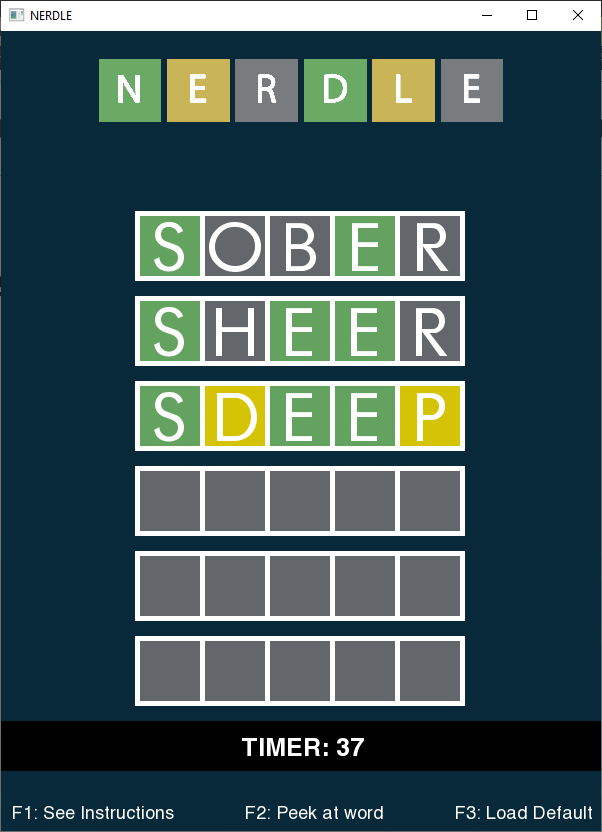

# NERDLE – The Word Guessing Game
A WORDLE clone created as semester project for my Data Structures course.

#### Aim and Motivation:
The game is inspired by the popular online game Wordle, which The New York Times Company has owned and published since 2022. Players are given six chances to identify a five-letter word. For each guess, players receive feedback in the form of coloured tiles that show which letters match or are in the right place. Our group remade it as a C++ desktop application so that players can play the game offline.

#### Background:
After a bit of research, our group decided to progress with the SFML GUI library for C++ because it was most suited and flexible compared to other GUI libraries as we were creating a grid game with limited inputs. Object Oriented Programming Principles are maintained throughout the project, and the backbone of the code is the _AVL Tree_ data structure.

#### Project Specification:
The following libraries were used in our project:
    1) SFML/Graphics.hpp _(External Library)_
    2) String _(Library)_
    3) iostream _(Library)_
    4) fstream _(Library)_

#### Detail, Functionality and Features:
Before the project is run, some preprocessing is done using C++ to calculate difficulty for each word in the game. The difficulty is calculated by a pre-determined formula, and the AVL is set up using that difficulty value, so that the median difficulty word becomes the root node, and the tree is balanced and all words are distributed in the tree accordingly.

The AVL tree is used in the project to return the Root Node’s word, and based on whether the player wins or loses, adjust the tree accordingly.  This makes the game get more difficult if the user keeps on winning, or easier if the user keeps on losing, accordingly.

In the game, the user is expected to enter a five-letter word. After each entry, the word is processed and background tiles change colours accordingly. The user is given 6 tries to guess each word, and both success and failure to do so results in a prompt being displayed, with the game statistics shown.

Filing is done to save the game data, which includes the library of words and scores, and the in-game information like number of wins and number of losses.

Moreover, both the original and the modified AVL tree data is saved so if the player decides to reset their progress, the original data can be reverted back.

The user can always see the instructions by pressing F1, peek at the word by pressing F2 and reset all the progress by pressing F3.

#### Screenshots:

#### Results:
Using the concepts learned during our Data Structures course, we were able to create a game with automatic difficulty management based on the player performance with the use of AVL Tree.

The SFML graphics library helped with the GUI implementation of the project, as now using C++, the game has a beautiful interface to play the game instead of the traditional console window.

The result is a fun word guessing game with a huge library of over 14,000 words to play and test your vocabulary with.

#### External References:
_(External files used in the project)_
Only one file, words.txt in the project was taken off the internet. The file includes all five-letter words (14,855 words) from Wordle’s library, and is compiled by [tabatkins](https://github.com/tabatkins/wordle-list) on GitHub.
## Acknowledgements

 - Saud Jamal (Group Member)
 - Muhammad Moiz (Group Member)